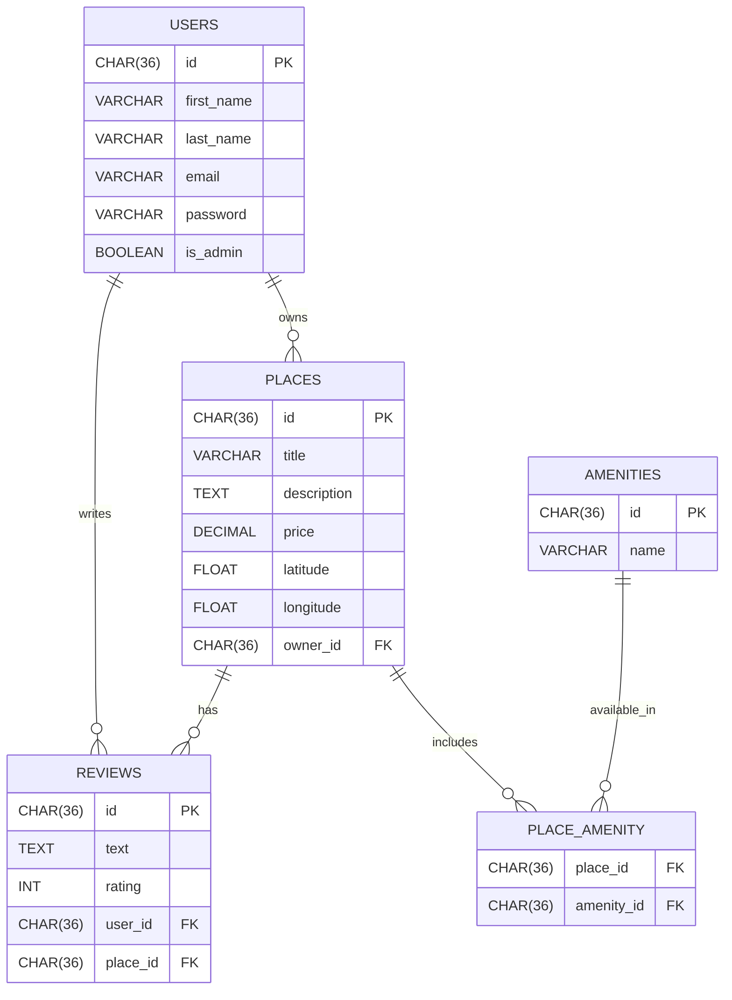

# HBnB Evolution (Part 3) – SQLAlchemy Integration, Authentication, and ER Modeling

## Overview

This phase of the **HBnB Evolution** project brings full database integration using **SQLAlchemy**, secure user authentication with **JWT**, and **Role-Based Access Control (RBAC)** for permission management. Additionally, SQL scripts are provided for initializing the database schema and inserting initial data. We also include a **Mermaid.js Entity-Relationship Diagram** to visualize the data model.

The system retains the **layered architecture** and **Facade pattern**, now enhanced with real persistence and authorization logic.

---

## Key Features

- SQLAlchemy-based ORM replacing in-memory storage
- JWT-based authentication and secure password hashing
- Admin users can manage all data (bypass ownership)
- Role-based access control for endpoints
- SQL scripts for schema generation and initial data
- Mermaid.js diagram for visualizing the data model

---

## Layers

- **Presentation Layer** – Flask RESTX API (routes, request parsing, responses)
- **Business Logic Layer** – Core models and logic (validation, authorization)
- **Persistence Layer** – SQLAlchemy repositories and storage

---

## Python Dependencies

Install required packages using:

```bash
pip install -r requirements.txt
```

`requirements.txt` includes:

- `flask`
- `flask-restx`
- `flask-bcrypt`
- `flask-jwt-extended`
- `sqlalchemy`
- `flask-sqlalchemy`

---

## Business Logic Layer

This layer defines the primary entities and handles validation and logic enforcement.

### Core Entities

- **User** – With attributes like `first_name`, `last_name`, `email`, `password`, `is_admin`, and relations to places and reviews.
- **Place** – Properties listed by users, with validation and relations to reviews and amenities.
- **Review** – Ratings and comments tied to places and users.
- **Amenity** – Describes features like "WiFi", "AC", etc.
- **Place\_Amenity** – A join table mapping many-to-many relationships between places and amenities.

---

## Authentication and Authorization

- Users must log in to receive a JWT.
- JWT includes admin flag used for RBAC checks.
- Admin users can manage any data.
- Regular users can only manage their own data (e.g., places, reviews).

---

## SQL Scripts

Found in the `scripts/` directory:

- `schema.sql` – Creates the entire schema with all foreign key constraints and relationships.
- `seed.sql` – Inserts the initial admin user (with a bcrypt-hashed password) and basic amenities (WiFi, Swimming Pool, Air Conditioning).

These can be run manually via SQLite or using SQLAlchemy + Flask shell.

---

## ER Diagram (Mermaid.js)

This diagram provides a visual reference of the database structure.



You can preview and export this diagram using the [Mermaid Live Editor](https://mermaid-js.github.io/mermaid-live-editor/).

---

## Directory Structure

```text
hbnb/
├── app/
│   ├── __init__.py
│   ├── extensions.py
│   ├── api/
│   │   ├── __init__.py
│   │   └── v1/
│   │       ├── __init__.py
│   │       ├── users.py
│   │       ├── places.py
│   │       ├── reviews.py
│   │       ├── amenities.py
│   ├── models/
│   │   ├── __init__.py
│   │   ├── base_model.py  
│   │   ├── user.py
│   │   ├── place.py
│   │   ├── review.py
│   │   ├── amenity.py
│   ├── services/
│   │   ├── __init__.py
│   │   ├── facade.py
│   │   ├── repositories/
│   │   │   ├── amenity_repository.py
│   │   │   ├── place_repository.py
│   │   │   ├── review_repository.py
│   │   │   └── user_repository.py
│   │   └── utils/
│   │       └── auth.py
│   └── persistence/
│       ├── __init__.py
│       └── repository.py
├── instance/
│   └── development.db
├── scripts/
│   ├── schema.sql
│   └── seed.sql
├── run.py
├── config.py
├── requirements.txt
└── README.md
```

---

## How to Run

```bash
export FLASK_APP=run.py
flask run
```

To initialize the database with schema and seed data:

```bash
flask shell
>>> from sqlalchemy import text
>>> with open("scripts/schema.sql") as f: db.session.execute(text(f.read()))
>>> with open("scripts/seed.sql") as f: db.session.execute(text(f.read()))
>>> db.session.commit()
```

---

