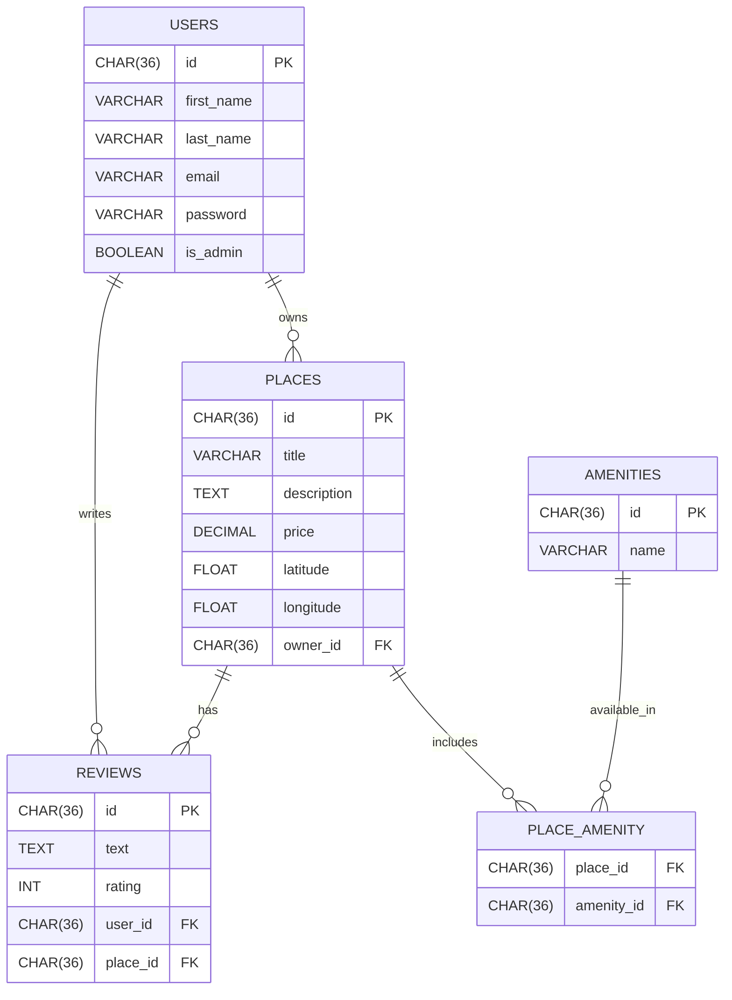

# HBnB Evolution (Part 4) – Frontend Integration with HTML, CSS, and JavaScript

## Overview

In Part 4, the **HBnB Evolution** project extends the backend API by adding a full **frontend interface** built with vanilla **HTML, CSS, and JavaScript**. This front-end enables users to:

- Log in and manage session tokens via cookies

- View the list of available places with filtering by price

- View detailed information about a specific place, including amenities and reviews

- Add new places (for authenticated users)

- Submit reviews for places (for authenticated users)

- Log out and handle authenticated navigation dynamically

The frontend communicates with the RESTful API backend via asynchronous fetch requests, leveraging JWT for secured endpoints.

---

## Key Features

- Responsive and interactive UI for places and reviews
- Authentication and token management using cookies
- Dynamic place filtering by price
- Place creation form with validation
- Review submission form on place detail page
- Navigation menu updates based on authentication state
- Error handling and user feedback on API actions

---
## Frontend Structure

- index.html – Home page listing places with price filtering

- place.html – Detailed place view with amenities and reviews

- login.html – User login form

- create_place.html – Form to add new places

- styles.css – Styles for consistent layout and design

- scripts.js – Main JavaScript file handling DOM interaction, API calls, and authentication

---

## Usage

1. Make sure the backend API server is running locally at http://localhost:5000/.

2. Open the frontend pages directly in a modern browser (Chrome, Firefox, Edge). For full functionality, serve files with a simple HTTP server if needed (e.g., python -m http.server).

3. Navigate to login.html to sign in. Upon successful login, a JWT token is stored in cookies for subsequent API requests.

4. Use the home page (index.html) to browse places. Filter by price using the dropdown.

5. Click on "View Details" for a place to see more information and reviews.

6. Authenticated users can add places via create_place.html and submit reviews on place detail pages.

7. Use the logout button in the navigation to clear the session token.

---

## How Frontend and Backend Communicate

- All API requests are sent to http://localhost:5000/api/v1/ endpoints.

- JWT tokens received on login are saved in cookies and attached to authorized requests.

- The frontend handles token expiration and redirects unauthorized users to login.

- Public data like place listings and details can be viewed without authentication.

- Actions like creating places and submitting reviews require login.

---

## Python Dependencies

Install required packages using:

```bash
pip install -r requirements.txt
```

`requirements.txt` includes:

- `flask`
- `flask-restx`
- `flask-bcrypt`
- `flask-jwt-extended`
- `sqlalchemy`
- `flask-sqlalchemy`

---

## SQL Scripts

Found in the `scripts/` directory:

- `schema.sql` – Creates the entire schema with all foreign key constraints and relationships.
- `seed.sql` – Inserts the initial admin user (with a bcrypt-hashed password) and basic amenities (WiFi, Swimming Pool, Air Conditioning).

These can be run manually via SQLite or using SQLAlchemy + Flask shell.

---

## ER Diagram (Mermaid.js)

This diagram provides a visual reference of the database structure.



You can preview and export this diagram using the [Mermaid Live Editor](https://mermaid-js.github.io/mermaid-live-editor/).

---

## Directory Structure

```text
hbnb/
├── app/
│   ├── __init__.py
│   ├── extensions.py
│   ├── api/
│   │   ├── __init__.py
│   │   └── v1/
│   │       ├── __init__.py
│   │       ├── users.py
│   │       ├── places.py
│   │       ├── reviews.py
│   │       ├── amenities.py
│   ├── models/
│   │   ├── __init__.py
│   │   ├── base_model.py  
│   │   ├── user.py
│   │   ├── place.py
│   │   ├── review.py
│   │   ├── amenity.py
│   ├── services/
│   │   ├── __init__.py
│   │   ├── facade.py
│   │   ├── repositories/
│   │   │   ├── amenity_repository.py
│   │   │   ├── place_repository.py
│   │   │   ├── review_repository.py
│   │   │   └── user_repository.py
│   │   └── utils/
│   │       └── auth.py
│   └── persistence/
│       ├── __init__.py
│       └── repository.py
├── instance/
│   └── development.db
├── scripts/
│   ├── schema.sql
│   └── seed.sql
├── static/
│   ├── images/
│   │   └── logo.png
│   ├── create_place.html
│   ├── index.html
│   ├── login.html
│   ├── place.html
│   ├── scripts.js
│   └── styles.css
├── run.py
├── config.py
├── requirements.txt
└── README.md
```
---

## Ensure your backend is running with:

```bash
export FLASK_APP=run.py
flask run
```

To initialize the database with schema and seed data:

```bash
flask shell
>>> from sqlalchemy import text
>>> with open("scripts/schema.sql") as f: db.session.execute(text(f.read()))
>>> with open("scripts/seed.sql") as f: db.session.execute(text(f.read()))
>>> db.session.commit()
```
---
Alternative:

```bash
flask --app run.py run
```
Then initialize the database with schema and seed data:

```bash
flask shell
>>> from sqlalchemy import text
>>> with open("scripts/schema.sql") as f:
>>>     sql_script = f.read()
>>> statements = [stmt.strip() for stmt in sql_script.split(';') if stmt.strip()]
>>> for stmt in statements:
>>>    db.session.execute(text(stmt))
>>> db.session.commit()
>>>
>>> from sqlalchemy import text
>>> with open("scripts/seed.sql") as f:
>>>     sql_script = f.read()
>>> statements = [stmt.strip() for stmt in sql_script.split(';') if stmt.strip()]
>>> for stmt in statements:
>>>    db.session.execute(text(stmt))
>>> db.session.commit()
```
---
## Browser

You can open the HTML files directly in your browser or use a simple HTTP server for better compatibility:

```bash
python3 -m http.server 5500
```
Then navigate to http://localhost:5500/part4/static/index.html in your browser.

---
## Backend Tests using Curl

Login as Admin:

```bash
curl -X POST http://127.0.0.1:5000/api/v1/auth/login \
  -H "Content-Type: application/json" \
  -d '{"email": "admin@example.com", "password": "admin123"}'
```

Create Users:

```bash
curl -X POST http://127.0.0.1:5000/api/v1/users/ \
     -H "Authorization: Bearer ADMIN_TOKEN_HERE" \
     -H "Content-Type: application/json" \
     -d '{"first_name": "Bob", "last_name": "User", "email": "bob@example.com", "password": "pass123"}'
```

Create Place:

```bash
curl -X POST http://127.0.0.1:5000/api/v1/places/ \
     -H "Authorization: Bearer USER_TOKEN_HERE" \
     -H "Content-Type: application/json" \
     -d '{"title": "My place", "description": "A cozy place", "price": 150, "latitude": 40.7128, "longitude": -74.0060}'
```

Create Amenity:

```bash
curl -X POST http://localhost:5000/api/v1/amenities/ \
     -H "Content-Type: application/json" \
     -H "Authorization: Bearer USER_TOKEN_HERE" \
     -d '{"name": "Air Conditioning", "description": "Central AC"}'
```

Write Review:

```bash
curl -X POST http://127.0.0.1:5000/api/v1/reviews/ \
    -H "Authorization: Bearer USER_TOKEN_HERE" \
    -H "Content-Type: application/json" \
    -d '{
    "text": "Amazing place!",
    "rating": 5,
    "place_id": "PLACEID_HERE"
    }'
```
Delete Review:

```bash
curl -X DELETE "http://127.0.0.1:5000/api/v1/reviews/REVIEW_ID_HERE" -H "Authorization: Bearer USER_TOKEN_HERE"
```

---
